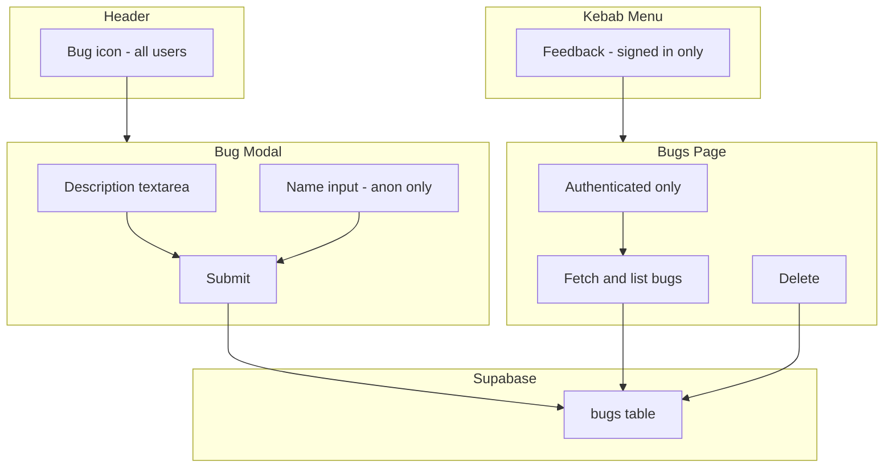

# Phase 5.5 — Bug Tracker

Bug report feature for test users to leave feedback (or leave notes for myself).

## TL;DR

- Bug icon in header opens a modal form
- Supabase `bugs` table stores submissions
- All users can submit; anonymous users provide their name; signed-in users are identified by email
- Signed-in users see a kebab option "Feedback (N)" with count; clicking it navigates to the bugs view

---

## 1. Supabase Schema

`**supabase/migrations/20260317000000_bugs_table.sql`**

- `bugs` table: `id` (text, PK), `description`, `author`, `viewport_width`, `device_info` (jsonb), `created_at`
- RLS: INSERT for `anon` and `authenticated`; SELECT for `authenticated` only

`**supabase/migrations/20260318000000_bugs_delete_policy.sql`**

- DELETE for `authenticated` users

`**device_info`** — Captures `user_agent`, `viewport_width`, `viewport_height`, `screen_width`, `screen_height`, `device_pixel_ratio`, `platform`, `language`, `device_memory`, `hardware_concurrency`, `max_touch_points` (wrapped in try/catch).

---

## 2. Report Entry Point

**Bug icon button** — `header-bug-btn` in [index.html](index.html), to the left of the kebab menu, triggers feebdack modal.

**Kebab option** — "Feedback" with count (`bugs-only`), visible only when authenticated, navigates to bugs view.

---

## 3. Bug Report Modal

[src/bugs.js](src/bugs.js) — `showBugReportModal({ onBugSubmitted })`

- Modal: `.sign-in-modal`, `.sign-in-modal-backdrop`, `.sign-in-modal-content`
- Fields: `description` (textarea, required), `name` (required, anon only)
- On submit: `generateBugId()`, `getDeviceInfo()`, `submitBug()`, close modal, toast "Thanks for your feedback! You're the best :)"

---

## 4. Bugs Page

- **Access:** Kebab-only "Feedback" link. `bugs-only` + `bugs-visible` when authenticated. Add `bugs` to `VALID_VIEWS`; no nav button.
- **Auth:** `showView` redirects to `entry` if not authenticated.
- **Renderer:** `renderBugs(container)` — fetches from Supabase, renders compact cards.
- Bugs list refreshes as bugs are added in real time.

**Card layout:**

- Author · time ago
- Description (truncated at 500 chars with "Show more" / "Show less")
- Details: ID, viewport, device summary, full `device_info` JSON
- Trash icon: right-click or long-press on card to reveal; positioned in top-right corner

**Delete:** `deleteBug(id)` + `showDeleteConfirmModal` — type "DELETE" to confirm.

---

## 5. API (bugs.js)

- `submitBug({ id, description, author, viewport_width, device_info })` — insert
- `loadBugs()` — select, ordered by `created_at` desc
- `getBugCount()` — for kebab caption
- `deleteBug(id)` — delete with `.select()` to verify row removed

---

## 6. Data Flow

---

## 7. Files

| File                                                        | Role                                                                                                              |
| ----------------------------------------------------------- | ----------------------------------------------------------------------------------------------------------------- |
| `supabase/migrations/20260317000000_bugs_table.sql`         | bugs table + RLS                                                                                                  |
| `supabase/migrations/20260318000000_bugs_delete_policy.sql` | delete policy                                                                                                     |
| [index.html](index.html)                                    | Bug icon button; `bugs-only` Feedback kebab option                                                                |
| [src/main.js](src/main.js)                                  | Wire bug icon, view-bugs; bugs view; `bugs-visible`; `onBugSubmitted` refresh                                     |
| [src/shared.css](src/shared.css)                            | `.header-bug-btn`, `.bugs-only` / `.bugs-only.bugs-visible`                                                       |
| [src/bugs.js](src/bugs.js)                                  | `showBugReportModal`, `renderBugs`, `submitBug`, `loadBugs`, `getBugCount`, `deleteBug`, `showDeleteConfirmModal` |
| [src/form.css](src/form.css)                                | Bug modal styles, bugs list/card styles                                                                           |
| [src/archive.css](src/archive.css)                          | Shared delete-confirm modal, archive-delete styles                                                                |

