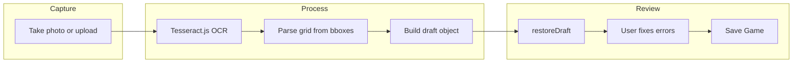

# Phase 6: Scan Paper Scoresheet (OCR)

Plan to add phone camera / upload flow for scanning a paper scoresheet and auto-populating the form. User reviews and fixes any OCR mistakes before saving.

## Overview

- **Goal:** Capture a photo of a paper scoresheet (or upload an image), run OCR in the browser, parse the round/player grid, and populate the scoresheet form. User corrects any errors and saves as usual.
- **Current state:** Form is fully manual. `restoreDraft(wrapper, draft)` in [form.js](src/form.js) already accepts `{ date, displayDate, players, scores, tunks, penalties }` and populates the UI.
- **Approach:**
  1. Add Tesseract.js for client-side OCR (no server, no API key)
  2. Parse OCR output (text + bounding boxes) into grid structure
  3. Build draft object and call `restoreDraft()`
  4. User reviews, fixes, saves

### User Flow




---

## Phase 6.1 — OCR and Parsing

Add Tesseract.js and a scan module that converts an image into a draft object.

### Approach

- Use `Tesseract.recognize()` with `words` output to get text and bounding boxes
- Cluster words by Y position (rows) and X position (columns)
- Infer layout: first column = round labels (3, 4, 5…J, Q, K); first row = player names; remaining cells = scores
- Detect special values: tunk (★), tink (0), magic 65 (65), penalty (FT)

### Tasks

- **6.1.1** Add dependency: `npm install tesseract.js`
- **6.1.2** Create [src/scan-scoresheet.js](src/scan-scoresheet.js):
  - `scanImage(fileOrBlob)` — runs OCR, returns draft-like object `{ date?, displayDate?, players, scores, tunks, penalties }`
  - Use `Tesseract.recognize(image, 'eng', { logger: m => {} })` and access `data.words`
  - Parse bboxes: group by approximate Y (rows), sort by X (columns)
  - Map first column to rounds (validate against `ROUNDS`), first row to players, grid to scores
  - Recognize tunk (★ or `*`), tink (0), magic 65 (65 in rounds 5–K)
  - Detect **false tunk / penalties** by reading **FT** (and common OCR variants) in cells; map to `penalties: ['round::player', ...]`—same semantics as the in-app false tunk (+65 for that player in that round), not by inferring from cumulative score math (OCR errors would make that unreliable)
  - Match partial or abbreviated player names to the existing roster, or prompt the user to pick or add a player
- **6.1.3** Handle edge cases: missing date (leave blank for the user; see 6.2.5 for draft persistence), unknown player names (ask user to identify), ambiguous cells (prefer numeric; flag low confidence if desired), human error in arithmetic

### Files

- New: `src/scan-scoresheet.js`
- Modify: `package.json` (add `tesseract.js`)

---

## Phase 6.2 — UI Integration

Wire scan flow into the form. User can capture or upload an image, then see the form populated.

### Approach

- Add "Scan" (with camera icon) button in New Game setup and scoresheet header
- On tap: show camera (mobile) or file input; accept image
- Show loading state during OCR (Tesseract can take several seconds)
- On success: call `restoreDraft(wrapper, parsedDraft)`; then persist when possible (see 6.2.5); optionally expand rounds accordion
- On error: show message, allow retry

### Tasks

- **6.2.1** Add "Scan scoresheet" control in [src/form.js](src/form.js) in **both** places: scoresheet header actions (e.g. `scoresheet-header-actions`, next to Clear / Start over) **and** the New Game setup surface (behavior when no scoresheet yet in 6.2.2)
- **6.2.2** If the user hasn't started a game yet: show scan in the setup area; on scan success, create the scoresheet with parsed players/date and call `restoreDraft`
- **6.2.3** Implement capture flow:
  - Use `<input type="file" accept="image/*" capture="environment">` for mobile camera
  - Fallback: file input without `capture` for upload
- **6.2.4** Show loading overlay or spinner during `scanImage()`; disable button while processing
- **6.2.5** On parse success: `restoreDraft(wrapper, draft)`, then call `persistDraft(wrapper)` **when** a persistable draft exists. **`restoreDraft` does not write localStorage.** Current code: `persistDraft` uses `getDraftFromScoresheet`, which returns `null` if there is no parseable game date ([form.js](src/form.js)); until that is relaxed, require the user to set a date (or default one) before persistence works, or extend `getDraftFromScoresheet` to allow draft-only saves without a date
- **6.2.6** On parse failure or empty result: show "Could not read scoresheet. Try a clearer photo or enter manually."

### Files

- Modify: `form.js`, `form.css` (button, loading state)

---

## Phase 6.3 — Layout and Expected Format

Document the expected paper scoresheet layout so parsing heuristics work reliably.

### Approach

- Assume a common layout: rounds in first column (3, 4, 5…J, Q, K), player names in first row, scores in grid
- Optional: add a short "Tips for best results" in the UI (good lighting, flat sheet, printed text works best)

### Tasks

- **6.3.1** Document expected layout in PHASE-6 or a short help tooltip:
  - Rounds in column 1; players across top; scores in cells
  - Tunk = ★ or *; tink = 0; magic 65 = 65; penalty = **FT** (false tunk; in-app adds +65 for that player in that round—see parser notes in 6.1.2)
- **6.3.2** (Optional) Add "Scan tips" link or modal with guidance

### Files

- Modify: `form.js` (tooltip/modal if added)

---

## Challenges and Mitigations


| Challenge                                                | Mitigation                                                                                             |
| -------------------------------------------------------- | ------------------------------------------------------------------------------------------------------ |
| **Table structure** — Tesseract returns text, not tables | Use bounding boxes to cluster words into rows/columns; round labels and player names anchor the layout |
| **Handwriting**                                          | OCR works best on printed text. Handwritten scoresheets will need more manual correction               |
| **Special values** — ★, 0, magic 65, FT                  | Teach parser to recognize these; user can fix misreads in the form                                     |
| **Layout variance**                                      | Start with one common layout; document it; expand later if needed                                      |


---

## Alternative: Cloud OCR

For higher accuracy (especially handwriting), consider **Google Document AI** or **AWS Textract**, which have table-detection APIs. That would require:

- Backend or Edge Function to call the API (keys must stay server-side)
- Network round-trip and possible cost per scan

Tesseract.js is a good first step; cloud OCR can be added later if needed.

---

## Reference

### Draft Format (for `restoreDraft`)

```js
{
  date: 'YYYY-MM-DD',           // optional; user can fill
  displayDate: 'M/D/YYYY',       // optional
  players: ['Name1', 'Name2'],   // required
  scores: { '3': { Name1: 21, Name2: 0 }, ... },  // round -> player -> value (string or number)
  tunks: { '3': 'Name2', ... },  // round -> player who tunked
  penalties: ['3::Name1', ...]   // 'round::player' for false tunks
}
```

**penalties** are false-tunk entries: each key marks that player for that round, and the live form adds +65 (same as choosing FT in the UI). OCR should detect **FT** on paper, not infer penalties from score totals.

### Rounds

From [src/constants.js](src/constants.js): `['3', '4', '5', '6', '7', '8', '9', '10', 'J', 'Q', 'K']`

### Files Summary


| File                     | Phase | Action                                       |
| ------------------------ | ----- | -------------------------------------------- |
| `src/scan-scoresheet.js` | 6.1   | New: OCR + grid parsing                      |
| `package.json`           | 6.1   | Add `tesseract.js`                           |
| `src/form.js`            | 6.2   | Scan control, capture flow, `restoreDraft`, `persistDraft` when persistable |
| `src/form.css`           | 6.2   | Button, loading state                        |


